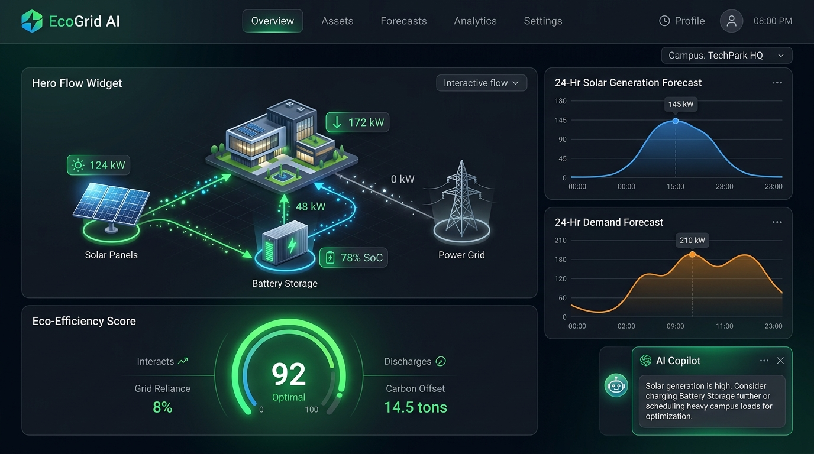
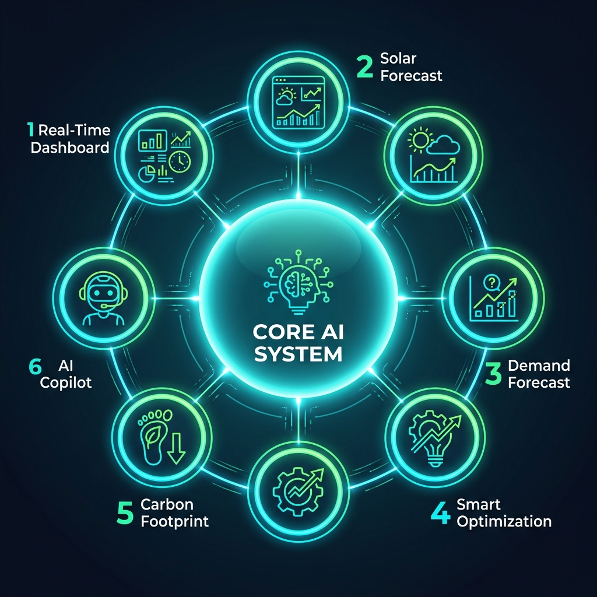
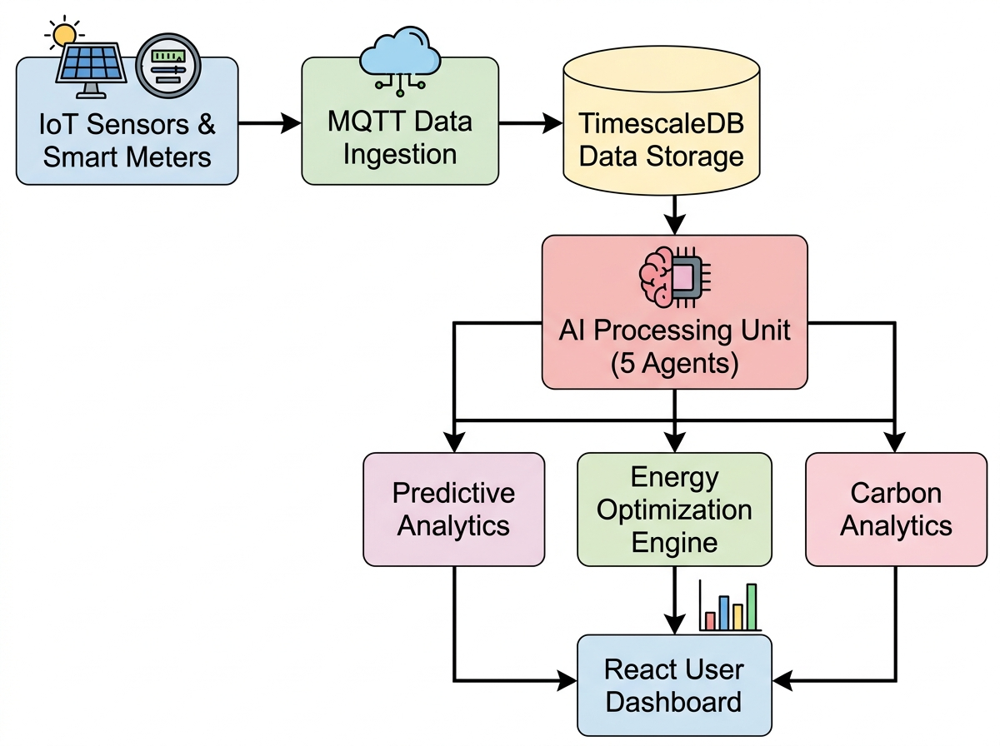

<div align="center">

# 🌿 EcoGrid AI Copilot

### Intelligent Green Energy Management System

#### A real-time, AI-driven microgrid optimization system that orchestrates solar generation, battery storage, and utility grid power to minimize costs and maximize carbon savings.

<p>

[]()
[]()
[]()
[]()
[]()
[]()

</p>

</div>

---

# 📑 Table of Contents

- [Project Overview](#-project-overview)
- [Core Features](#-features)
- [System Architecture](#-system-architecture)
- [How It Works](#-how-it-works)
  - [Hardware Telemetry Simulation](#1-hardware-telemetry-simulation)
  - [Predictive Forecasting](#2-predictive-forecasting)
  - [Algorithmic Optimization](#3-algorithmic-optimization)
  - [Real-Time Dashboard](#4-real-time-dashboard)
- [Tech Stack](#-tech-stack)
- [Quickstart Guide](#-quickstart-guide)
  - [Prerequisites](#prerequisites)
  - [Backend Setup](#backend-setup)
  - [Frontend Setup](#frontend-setup)
- [License](#-license)

---

# 📖 Project Overview



**EcoGrid AI Copilot** is a state-of-the-art energy management system built to tackle the challenges of modern microgrid orchestration. Built as a comprehensive solution for the "Build with Bharat" hackathon, the platform acts as an intelligent bridge between volatile renewable energy sources (Solar PV), energy storage (BESS), and dynamic campus loads. 

By leveraging predictive machine learning models, EcoGrid forecasts energy supply and demand 24 hours into the future. This forecasted data is then fed into an advanced linear optimization engine (Google OR-Tools), which computes the most cost-effective and carbon-efficient schedule for charging and discharging the central battery system.

To provide operators with complete visibility, the system features a stunning, high-performance React dashboard complete with live animated SVG network topologies, historical energy mix analytics, and an integrated **Gemma-4 (31B)** AI Copilot. This conversational assistant allows facility managers to query their grid's status, carbon offset data, and optimization rationale using natural language.

---

# ✨ Core Features



- **Live Animated Topology**: A premium, dark-mode SVG network graph with moving, glowing energy particles that visually represent real-time power flow between Solar, Grid, Battery, and Campus loads.
- **Predictive Energy Forecasting**: Analyzes historical weather and load data to accurately predict solar generation and campus power consumption.
- **AI Battery Optimization**: Automatically schedules Battery Energy Storage System (BESS) charging during low-cost or high-solar periods and discharging during peak utility pricing.
- **Dynamic Analytics**: Interactive area charts comparing historical grid import versus solar generation across 24-hour, weekly, and monthly time horizons (auto-scaling to kWh).
- **Conversational Copilot**: A Google Gemma-4 powered assistant that understands live grid telemetry and can answer complex operational queries.
- **Hardware-in-the-Loop Simulation**: A robust Python/MQTT background simulator that streams realistic, fluctuating microgrid sensor data.

---

# 🏗 System Architecture



The application is built on a high-performance **FastAPI** backend that acts as the central nerve center. It continuously ingests simulated hardware telemetry via a background worker thread. 

The analytical engine executes hourly optimizations using **OR-Tools**, adjusting the battery's state to minimize Time-of-Use (TOU) tariffs. The frontend, built with **React and Vite**, polls these endpoints to render fluid UI updates, utilizing Recharts for data visualization and Tailwind CSS for rapid styling.

---

# ⚙️ How It Works

### 1. Hardware Telemetry Simulation
The `simulator.py` script continuously generates realistic power metrics (kW) with localized variance, simulating the behavior of a live solar array, campus buildings, and a battery management system.

### 2. Predictive Forecasting
The system uses pre-trained machine learning models (stored in `backend/models/`) to predict the next 24 hours of solar output and energy demand based on historical CSV datasets.

### 3. Algorithmic Optimization
The OR-Tools engine takes the 24-hour forecast and solves a constrained optimization problem: *How do we route power to minimize grid import cost, given the battery's maximum capacity, charge rate limits, and expected solar surplus?*

### 4. Real-Time Dashboard
The frontend displays the live results. Complex React state management ensures that as the time-range toggles (24h/Week/Month) are clicked, the UI smoothly transitions and re-fetches accurate data.

---

# 💻 Tech Stack

### Frontend
- **React 19** + **Vite**
- **Tailwind CSS** (Styling & Animations)
- **Recharts** (Data Visualization)
- **Lucide React** (Iconography)

### Backend
- **FastAPI** (REST API)
- **Uvicorn** (ASGI Server)
- **Google OR-Tools** (Linear Optimization)
- **Pandas / Scikit-Learn** (Forecasting)

### AI
- **Google Gemma-4 (31B)** (Conversational Copilot)

---

# 🚀 Quickstart Guide

### Prerequisites
- Python 3.10+
- Node.js 18+

### Backend Setup
1. Navigate to the backend directory:
   ```bash
   cd backend
   ```
2. Create a virtual environment and install dependencies:
   ```bash
   pip install -r requirements.txt
   ```
3. Start the FastAPI server:
   ```bash
   uvicorn main:app --port 8000
   ```
4. In a separate terminal, start the hardware simulator:
   ```bash
   python simulator.py
   ```

### Frontend Setup
1. Navigate to the frontend directory:
   ```bash
   cd frontend
   ```
2. Install NPM dependencies:
   ```bash
   npm install
   ```
3. Start the Vite development server:
   ```bash
   npm run dev
   ```

You can now view the dashboard at `http://localhost:5173`.

---

# 📄 License

This project was built for the **Build with Bharat** Hackathon. All rights reserved.
