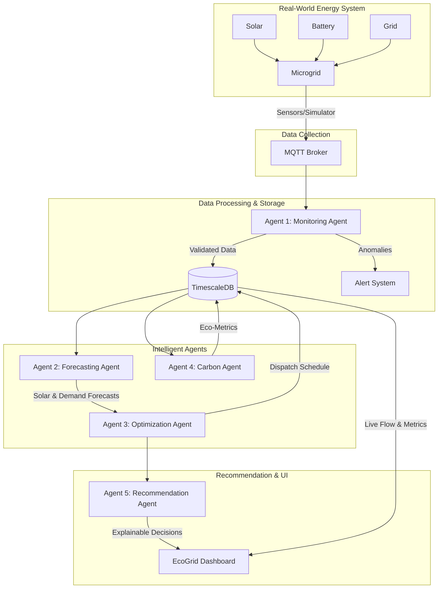

# System Architecture & Design
**Project Name:** EcoGrid AI

## 1. High-Level Architecture Overview (The 5-Agent Pipeline)
EcoGrid AI utilizes a strict multi-agent architecture. The system is decoupled, allowing each intelligent agent to handle a specific operational domain asynchronously.

## 2. The 5-Agent Specifications

### Agent 1: Monitoring Agent
*   **Responsibility:** The gatekeeper of data. Collects incoming telemetry from the MQTT broker, validates it for missing or inconsistent readings, and runs the Anomaly Detection model to flag hardware failures (e.g., HVAC overloads).

### Agent 2: Forecasting Agent
*   **Responsibility:** Predictive intelligence. Reads historical data and weather APIs to output arrays representing predicted future energy demand and predicted solar generation.

### Agent 3: Optimization Agent
*   **Responsibility:** Energy routing. Takes the forecasts and calculates the mathematical optimum for battery charging, flexible load scheduling, and grid interaction (import/export).

### Agent 4: Carbon Agent
*   **Responsibility:** Sustainability metrics. Continuously calculates real-time carbon emissions based on grid import, calculates avoided emissions, and generates the live Eco Efficiency Score.

### Agent 5: Recommendation Agent (AI Copilot)
*   **Responsibility:** Explainability. Converts the rigid math of the Optimization Agent into actionable, plain-English recommendations for the user interface.

## 3. Technology Stack Mapping
*   **Frontend:** React, Tailwind CSS, Recharts (Chart.js alternative).
*   **Backend (Agents):** Python, FastAPI.
*   **Data Processing:** Pandas, NumPy.
*   **Machine Learning (Forecasting/Anomalies):** Scikit-learn, XGBoost, Random Forest.
*   **Optimization:** Google OR-Tools / PuLP (Linear Programming).
*   **Database:** PostgreSQL + TimescaleDB.
*   **Real-Time Comms:** WebSockets, MQTT.
